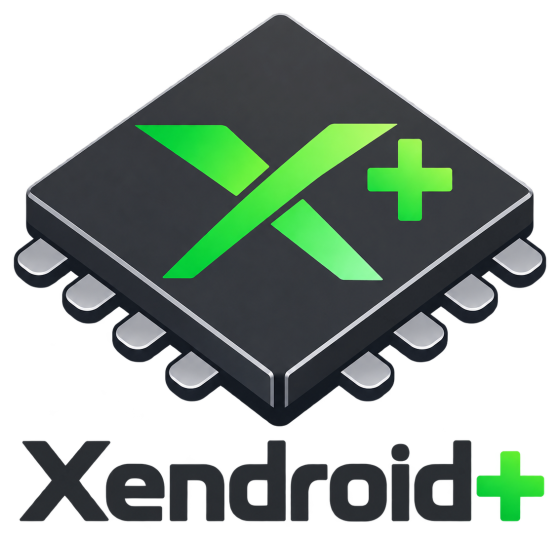

<p align="center">
  <picture>
    <source media="(prefers-color-scheme: dark)" srcset="docs/assets/xendroid-plus-logo-dark.png">
    
  </picture>
</p>

<p align="center"><strong>Emulação de Xbox 360 no Android, ajustada para Snapdragon e Adreno.</strong></p>

<p align="center">
  
  
  
  <a href="https://discord.gg/AT8Bswv62"></a>
</p>

<p align="center"><a href="README.md">English</a> · <b>Português (Brasil)</b></p>

---

O **Xendroid+** é um emulador de Xbox 360 para Android, criado e mantido por
**[phforner0](https://github.com/phforner0)**. Ele dá continuidade ao projeto XenDroid
e se apoia no [Xenia](https://github.com/xenia-project/xenia). Traz uma interface
redesenhada para celulares, tablets e controles, ajustes por jogo aplicados
automaticamente e um trabalho de desempenho e precisão medido quadro a quadro em
aparelhos reais.

> [!NOTE]
> O Xendroid+ é experimental. Como cada jogo roda depende do jogo, do aparelho e do
> driver da GPU: alguns títulos rodam bem, outros ainda têm falhas ou não iniciam.

## Destaques

### Uma interface nova
- **Biblioteca** com busca por nome ou Title ID, favoritos, ordenação, tempo de jogo e
  *Jogados recentemente*, toda navegável pelo controle.
- **Menu durante o jogo** com páginas de gráficos, HUD, controles e sessão, aberto pela
  alça na tela, por Back/Guide ou pelos botões de ombro.
- **Assistente de primeira execução**, perfis de jogador, backup e restauração de saves
  (com diário de recuperação e lixeira), instalação de atualizações (TU) e DLC.
- **Controles de toque** com editor de layout e analógicos adaptativos opcionais.

### Desempenho, medido no aparelho
- **Ajustes por jogo** aplicados quando o título inicia, nos jogos que precisam deles:
  Forza Horizon, Forza Horizon 2, Gears of War 3, Need for Speed: Most Wanted e outros.
- **Menos transferências de EDRAM** na GPU: transferências que um draw sobrescreve são
  puladas e, nos jogos que permitem, a profundidade desenhada em 4× MSAA vai direto para
  a superfície 1× e as faixas do tiling predicado são desenhadas uma vez só.
- **Atalhos exatos nos shaders** (decodificação do sinal das texturas, arredondamento de
  21 bits), cargas de textura direto nas imagens, resolves diretos no host e o
  compilador de shaders do Turnip configurado para muitos draws pequenos.
- **Trabalho no JIT ARM64**: tratamento de NaN exato e barato, reservas do guest
  protegidas contra ABA e denormais do VMX zerados como no console.
- **Compilação de shaders assíncrona** com cache de pipelines persistente.

### Ferramentas
- **HUD de desempenho** (FPS, tempo de quadro, CPU, GPU, RAM, temperaturas) e limite de
  FPS por jogo (ilimitado, ou de 30 a 120 FPS).
- **Escala e nitidez da imagem**, incluindo o Snapdragon Game Super Resolution.
- **Gerenciador de drivers** Adreno/Turnip, global ou por jogo, com verificação SHA-256.
- **Histórico de jogo** com percentis do tempo de quadro, pacote de diagnóstico para
  compartilhar, notas de compatibilidade locais e perfis de ajustes da comunidade.
- **Geração de quadros** (experimental, desligada por padrão): Win-FG 2× e LSFG com o
  seu próprio `Lossless.dll`.

## Desempenho

Medido num **POCO F7** (Snapdragon 8s Gen 4, Adreno 825) com Turnip, em builds de
desenvolvimento (outubro de 2026). Seu aparelho, driver e versão do jogo vão mudar
estes números.

| Jogo | Testado em | Taxa de quadros | Observações |
|---|---|---|---|
| Forza Horizon | Corrida | 30 fps (limite do jogo) | ~18 ms de GPU por quadro |
| Forza Horizon 2 | Corrida | 27–30 fps | Com os ajustes do Forza Horizon |
| Gears of War 3 | Campanha, Versus | 30 fps (limite do jogo) | GPU de 40 → 28 ms por quadro na cena mais pesada |
| Halo 4 | Campanha | ~26–30 fps | Cutscenes em vídeo corrigidas; resta um leve tremor de sombra |
| Need for Speed: Most Wanted | Corrida | ~19 fps | Travamentos na abertura e na gameplay corrigidos |
| Sonic Unleashed | Gameplay | 50–52 fps | |
| Halo: Reach | Menus, abertura | 30 fps | Cai a 19 fps |
| Crysis 3 | Menus, abertura | 32–46 fps | Travamento do JIT corrigido |
| Grand Theft Auto IV | Menus, abertura | ~22 fps | Limitado pela thread de comandos da GPU |
| Red Dead Redemption | Menus, abertura | ~25 fps | Limitado pela thread de comandos da GPU |

As medições, os métodos e os planos de otimização estão em
[`performance-tests/`](performance-tests); os ajustes por jogo são explicados no
[GAME_COMPAT.md](GAME_COMPAT.md).

## Requisitos

- Android 10 ou mais novo, ARM de 64 bits (arm64-v8a).
- GPU com Vulkan. Adreno 7xx e 8xx com o driver Turnip são o foco; recomenda-se um
  Snapdragon 8 Gen 2 ou mais novo.
- Seus próprios jogos de Xbox 360, extraídos de discos ou consoles seus: imagens de
  disco (ISO), arquivos ZAR ou pacotes Games on Demand (GOD).

## Primeiros passos

1. Instale o APK do Xendroid+.
2. Abra e siga o assistente de primeira execução: escolha sua pasta de jogos, ou deixe
   que ele crie uma, junto com as pastas de atualizações e DLC.
3. Escolha um jogo na biblioteca. Durante o jogo, abra o menu pela alça na tela, ou com
   Back/Guide no controle.

## Compilando

O Xendroid+ compila com o JDK 21, o Android SDK e NDK e as ferramentas de shaders
SPIR-V. O passo a passo para Linux e Windows está no [BUILD.md](BUILD.md):

```sh
./gradlew :app:assembleRelease
```

## Documentação

- [BUILD.md](BUILD.md): compilar, testar e instalar.
- [GAME_COMPAT.md](GAME_COMPAT.md): ajustes por jogo e como são carregados.
- [`performance-tests/`](performance-tests): medições no aparelho e os planos de
  otimização por trás de cada mudança.
- [docs/ui-redesign](docs/ui-redesign): o redesenho da interface;
  [docs/experiencia-em-jogo-status.md](docs/experiencia-em-jogo-status.md): situação dos
  recursos e validações pendentes.

## Créditos

- **Xendroid+**: criado e mantido por **[phforner0](https://github.com/phforner0)**.
- **XenDroid**, o port original para Android, por **[rfandango](https://github.com/rfandango)**.
- **[Xenia](https://github.com/xenia-project/xenia)** e Xenia Canary, o projeto de
  pesquisa em emulação de Xbox 360 de onde vem o núcleo de emulação.
- Geração de quadros, fontes, escala de imagem e os demais componentes de terceiros
  mantêm suas próprias licenças, listadas no [THIRD-PARTY-NOTICES.md](THIRD-PARTY-NOTICES.md).

## Aviso legal

O Xendroid+ é um projeto de código aberto, sem fins comerciais, para pesquisa,
desenvolvimento de software e testes de desempenho. Não tem vínculo com a Microsoft nem
é endossado por ela; Xbox e Xbox 360 são marcas da Microsoft Corporation.

O projeto não apoia a pirataria. Nenhum jogo, imagem de disco, firmware, arquivo de
sistema ou chave é incluído ou distribuído. Use apenas cópias de jogos que você possui,
extraídas de hardware que você possui.

## Comunidade

Participe da conversa no [Discord](https://discord.gg/AT8Bswv62).
